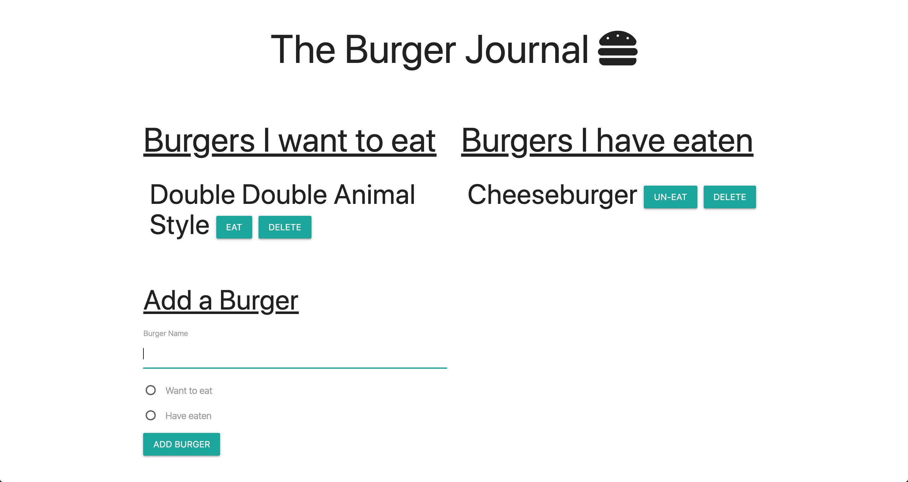

# The Burger Journal
The Burger Journal is a node.js app that allows users to keep a log of burgers they have eaten and burgers they want to eat. Deployed with Heroku, the app utilizes sequelize/mysql/jawsdb to implement CRUD database principles. 

## Deployed URL
https://guarded-citadel-13071.herokuapp.com/

## Screenshot
